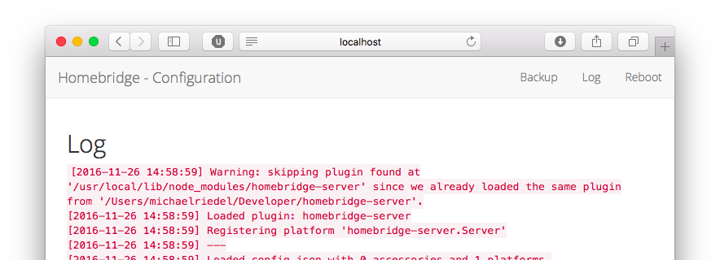

[](https://travis-ci.org/gismo141/homebridge-server)

[](https://nodei.co/npm/homebridge-server/)
[](https://nodei.co/npm/homebridge-server/)

# Homebridge Server - a plugin to configure your homebridge-devices via your Browser

The purpose of this plugin is to change your homebridge configuration via the webbrowser.
Therefore the JSON-things will be handled by the plugin and you - as a user - can easily add your devices to the bridge.


## What can you do with this plugin?

1. Change the broadcasted name of your Homebridge
2. Change the MAC-address used to identify your Homebridge
3. Change the PIN to verify your Homebridge
4. Add or Remove platforms
5. Add or Remove accessories
6. Change the names of your services
7. Backup your configuration
8. Show the Log-file of Homebridge
9. Reboot your system

## How to setup?

Fast way:

```Bash
[sudo] npm install homebridge-server@latest -g
```

Add this snippet to your `config.json`:

```JSON
{
    "platform": "Server",
    "port": 8765,
    "name": "Homebridge Server",
    "log" : "<PATH_TO_YOUR_LOG_FILE>"
}
```

and launch or restart your homebridge, e.g.:

```Bash
homebridge -D -U <HOMEBRIDGE_CONFIG_FOLDER>
```

See the Wiki on how to [configure](), [install]() and [use]() the plugin for more complex scenarios.

## Log-File

You can directly see what's happening on your Homebridge - just hit the button in the menubar and the Log is shown on the webpage!



## Backup of your Configuration

If you want to backup your configuration, just hit the Backup-button in the menubar of the webpage.
The configuration will be saved at the same location of your original configuration but with an `.bak` extension.
So whenever you crash your config you should have a valid backup!


## Rebooting your System

To make the changes in your configuration permanent, you need to restart the Homebridge-service.
If you want, you can restart your Homebridge-running system directly via the webpages `Reboot`-button.
Just hit the button in the menubar and wait, until your system has rebooted and your services are back online.

**Disclaimer**

The reboot is immediate!
If your Homebridge is not running as a service but as a standalone program you launch manually, the Homebridge won't restart automatically.
This only works, if Homebridge is set up as a service on boot!

Please make sure to restart Homebridge manually if you haven't set it up as a service.

If you want to start homebridge as a service, see [Running Homebridge on Bootup](https://github.com/nfarina/homebridge/wiki/Running-HomeBridge-on-a-Raspberry-Pi#running-homebridge-on-bootup).

## How could you contribute?

1. [Fork this project][fork] to your account.
2. [Create a new branch][branch] for the improvements, you intend to make.
3. **Make the changements in your fork.**
4. [Send a pull-request][pr] from your fork’s branch to my `master` branch.
 
You can always use the web-interface to make the changes you want. It helps you automizing the workflow from above.

[fork]: http://help.github.com/forking/
[branch]: https://help.github.com/articles/creating-and-deleting-branches-within-your-repository
[pr]: http://help.github.com/pull-requests/
