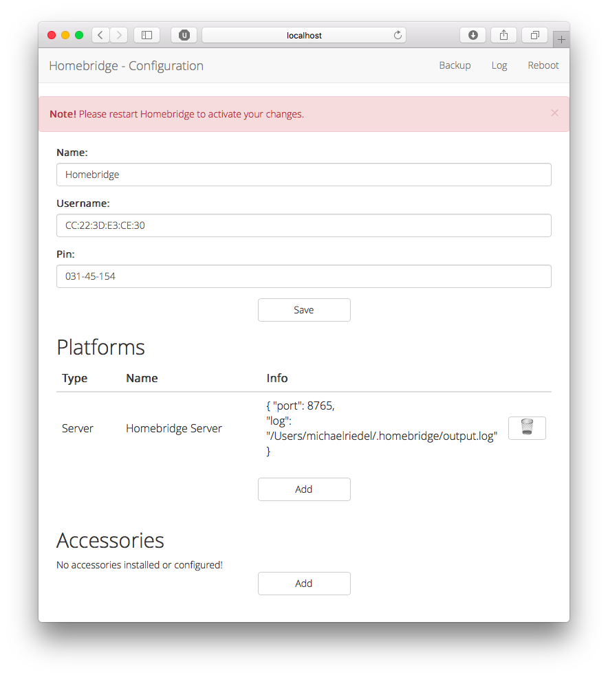

[](https://travis-ci.org/gismo141/homebridge-server)

# Homebridge Server - a plugin to configure your homebridge-devices via your Browser

The purpose of this plugin is to change your homebridge configuration via the webbrowser.
Therefore the JSON-things will be handled by the plugin and you - as a user - can easily add your devices to the bridge.



## What can you do with this plugin?

1. Change the broadcasted name of your Homebridge
2. Change the MAC-address used to identify your Homebridge
3. Change the PIN to verify your Homebridge
4. Add or Remove platforms
5. Add or Remove accessories
6. Change the names of your services
7. Backup your configuration
8. Show the Log-file of Homebridge
9. Reboot your system

## How to setup?

### Configuration

Add the following platform to your Homebridge `config.json`, whereas the `<PATH_TO_YOUR_LOG_FILE>` means the path where homebridge stores its log.
This can either be set up by the script you're calling on boot or, by the call you issue to launch homebridge.
See [Usage](#usage) for further information.


```JSON
{
	"platform": "Server",
	"port": 8765,
	"name": "Homebridge Server",
	"log" : "<PATH_TO_YOUR_LOG_FILE>"
}
```

### Installation

```Bash
[sudo] npm install homebridge-server@latest -g
```

### Usage

Depending on your configuration you need to adapt the call!
The basic structure is:

```Bash
homebridge -D -U <HOMEBRIDGE_CONFIG_FOLDER>
```

so using the above example:

```Bash
homebridge -D -U ~/.homebridge
```

After this command, you should be able to access the server on your local machine under `http://localhost:8765`.

#### Log-File

To enable the plugin to show you the log, you have to put this file-path into your config, whereas `<HOMEBRIDGE_LOG_FILE>` should match in the `config.json` and in the call:

```JSON
{
	"platform": "Server",
	"port": 8765,
	"name": "Homebridge Server",
	"log" : "<HOMEBRIDGE_LOG_FILE"
}
```

and launch Homebridge via:

```Bash
homebridge -D -U <HOMEBRIDGE_CONFIG_FOLDER> > <HOMEBRIDGE_LOG_FILE> 2>&1 &
```

If you want to use e.g. `/home/pi/.homebridge/output.log` as `<HOMEBRIDGE_LOG_FILE>` the config will be:

```JSON
{
	"platform": "Server",
	"port": 8765,
	"name": "Homebridge Server",
	"log" : "/home/pi/.homebridge/output.log"
}
```

and the call will be:

```Bash
homebridge -D -U /home/pi/.homebridge > /home/pi/.homebridge/output.log 2>&1 &
```

By issueing the above command, the output of Homebridge will be written to the file `/home/pi/.homebridge/output.log` and you should be able to view it in your browser by clicking on the Log-Button on the webpage.


#### Backup of your Configuration

If you want to backup your configuration, just hit the Backup-button in the menubar of the webpage.
The configuration will be saved at the same location of your original configuration but with an `.bak` extension.
So whenever you crash your config you should have a valid backup!


#### Rebooting your System

To make the changes in your configuration permanent, you need to restart the Homebridge-service.
If you want, you can restart your Homebridge-running system directly via the webpages `Reboot`-button.
Just hit the button in the menubar and wait, until your system has rebooted and your services are back online.

**Disclaimer**

The reboot is immediate!
If your Homebridge is not running as a service but as a standalone program you launch manually, the Homebridge won't restart automatically.
This only works, if Homebridge is set up as a service on boot!

Please make sure to restart Homebridge manually if you haven't set it up as a service.

If you want to start homebridge as a service, see [Running Homebridge on Bootup](https://github.com/nfarina/homebridge/wiki/Running-HomeBridge-on-a-Raspberry-Pi#running-homebridge-on-bootup).

## As a Developer

Clone this repository (to `<PLUGIN_DOWNLOAD_FOLDER>` e.g.: `~/Developer/homebridge-server`)

```Bash
git clone https://github.com/gismo141/homebridge-server ~/Developer/homebridge-server
cd ~/Developer/homebridge-server
npm install
```

Add the following platform to your Homebridge `config.json`:
```JSON
{
	"platform": "Server",
	"port": 8765,
	"name": "Homebridge Server",
	"log" : "<PATH_TO_YOUR_LOG_FILE>"
}
```

Adapt the call below and launch Homebridge:

```Bash
homebridge -D -U <HOMEBRIDGE_CONFIG_FOLDER> -P <PLUGIN_DOWNLOAD_FOLDER>
```

If you want to use the Log-preview, adapt the call accordingly:

```Bash
homebridge -D -U <HOMEBRIDGE_CONFIG_FOLDER> -P <PLUGIN_DOWNLOAD_FOLDER> > <HOMEBRIDGE_LOG_FILE> 2>&1 &
```

For the given example, the call could look like:

```Bash
homebridge -D -U ~/.homebridge -P ~/Developer/homebridge-server > ~/.homebridge/output.log 2>&1 &
```

After this command, you should be able to access the server on your local machine under `http://localhost:8765`.

## How could you contribute?

1. [Fork this project][fork] to your account.
2. [Create a new branch][branch] for the improvements, you intend to make.
3. **Make the changements in your fork.**
4. [Send a pull-request][pr] from your fork’s branch to my `master` branch.
 
You can always use the web-interface to make the changes you want. It helps you automizing the workflow from above.

[fork]: http://help.github.com/forking/
[branch]: https://help.github.com/articles/creating-and-deleting-branches-within-your-repository
[pr]: http://help.github.com/pull-requests/
